# The NutriSafe Architecture

## Business Architecture

The community uses a stakeholder map shown in Fig. 1 and the NutriSafe infrastructure as the central element of the design. The community comprises many actors typical for any food supply chain and actors specific for the scenario of soft cheese production, namely dairy and milk truck.

 

      
      
      Fig. 1: Stakeholder map for the cheese supply chain (left)
      
     Fig. 2: Supply chain access to the blockchain (right)

<i>
<b>Source:</b> Lamken, D., Wagner, T., Hoiss, T., Seidenfad., K., Hermann, A., Kus, M., & Lechner, U. (n.d.). Design patterns and framework for blockchain integration in supply chains. 2021 IEEE International Conference on Blockchain and Cryptocurrency (ICBC) 
</i>  

The supply chain depicted in Fig. 2 starts with the milk farm. The milk farm hands over the fresh milk to a milk truck, which transports milk to the dairy and takes a sample for quality checks. The dairy processes fresh milk to produce, e.g., soft cheese transported by a logistics service provider to a retailer. The end customer buys the product, the soft cheese, at a grocery store. We assume that all actors use the blockchain to share information concerning production and logistics. A core user story is the creation of traceable product history. The product history is, e.g., providing information to the end-customer or for efficient tracking and tracing in a food safety issue.

## Architecture Layers

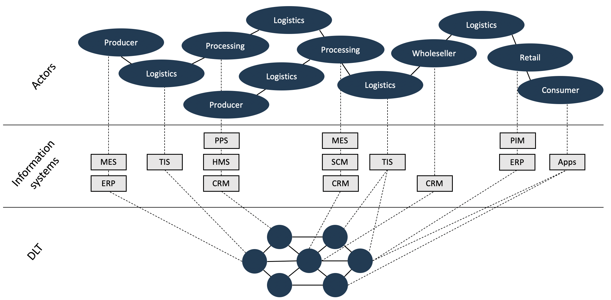 
      
    Fig. 3: Conceptual architecture of a DLT-based supply chain 

<i>
<b>Source:</b> Hrestic, R., Hermann, A., Hofmeier, M., Hoiß, T., Seidenfad, K., & Lechner, U. (2020). Supply Chains Meet Fintech: Is Tokenization an Option? 3rd International FinTech, InsurTech & Blockchain Forum.
</i> 

 
The conceptual architecture of a blockchain as infrastructure is depicted in Fig. 3 Actors have their information systems: ERP Systems, customer relationship management systems (CRM), herd management systems (HMS), and systems used by logistics service providers to manage transportation.
 
Note that the depicted supply chain is quite linear. In reality, there are many farmers, logistics service providers, production facilities, wholesalers, and retailers that participate in a supply chain. An analysis of the scenarios resulted in requirements and design decisions.

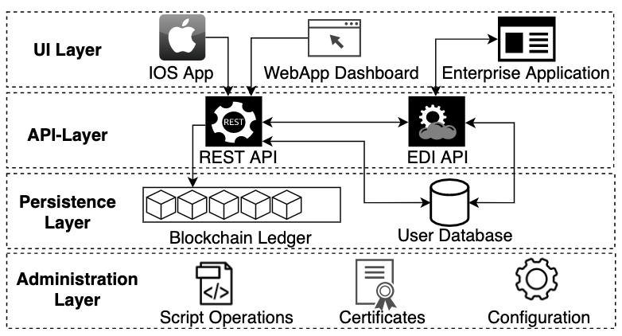 
      
     Fig. 4: The layered architecture to bridge between applications and blockchain network

<i><b>Source:</b> Seidenfad, K., Hoiss, T., & Lechner, U. (2021). A blockchain to bridge business information systems and industrial automation environments in supply chains. In G. Krieger, U.R., Eichler, G., Erfurth, C., Fahrnberger (Ed.), 21st International Conference on Innovations for Community Services. Springer.
</i> 

The technical architecture is structured in four layers, as depicted in Fig. 4. 
 
<b>The UI Layer</b> contains the WebApp dashboard, an IOS application designed to enable mobile access and information provision to the blockchain state. The web application and the IOS app use JSON over HTTP to send REST-Calls to the NutriSafe REST API.
 
<b>The API Layer</b> builds a layer of abstraction to the underlying system. The REST API and the EDI API provide the connectivity of user faced applications and the blockchain infrastructure. In small and medium-sized enterprises, EDI is a common standard for communication with business partners. REST is the de-facto standard for web-interfaces. We propose an EDI API which enables accessibility by enterprise applications.
 
<b>The Persistence Layer</b> with the blockchain ledger and a shared user database. The shared user database enables the authenticity of users or systems for all APIs. The web application provides user management with an interface for adding, deleting, and changing user details and rights to invoke chaincode. 
 
<b>The Administration Layer</b> contains the operational support and necessities for configuring and maintaining a Hyperledger Fabric network. The designed scripts for creating update transactions enable a fast way to expand the network. Configuration files are inherent by the blockchain framework and are customized for our scenario.

## REST API

The REST API provides the interface for all web applications to the blockchain. Note that the first design iteration of NutriSafe utilizes a REST API for each organization.
 
The RESTful interface (cf. Fig. 5) provides a set of functions to enable the interaction with the NutriSafe Hyperledger Fabric network. To authenticate the transaction proposals to the blockchain network, the user's organization's certificate and the corresponding key have to be accessible for the REST API. Custom clients transfer username and password to receive a JSON Web Token (JWT) per session on the REST API. Since the REST API hosts its own user database, user management is also part of its feature set. Customizable whitelists define the function calls per user and are adjustable to chaincode updates.

 
  
   
    Fig. 5: The component model of the REST API

## MQTT API

A setup with mechatronic components and an MES is depicted in Fig. 6. The MES is utilizing the REST API. The mechatronic components such as PLC and sensors are accessing our MQTT API, which consists of an MQTT broker and an MQTT-to-BC-Gateway. To increase interoperability, we propose all MQTT devices to be compliant with the Sparkplug B specification.  
Since MQTT is offering a large flexibility for topic naming and payload encoding, this flexibility becomes a limitation when different organizations want to access dis- tributed data of a less known OT-environment. Sparkplug is a standardization project by the Eclipse Foundation and a recent approach to reach more interoperability in the IoT, by making MQTT data more reasonable. It contains specifications for semantic topic naming, session states and payload management.

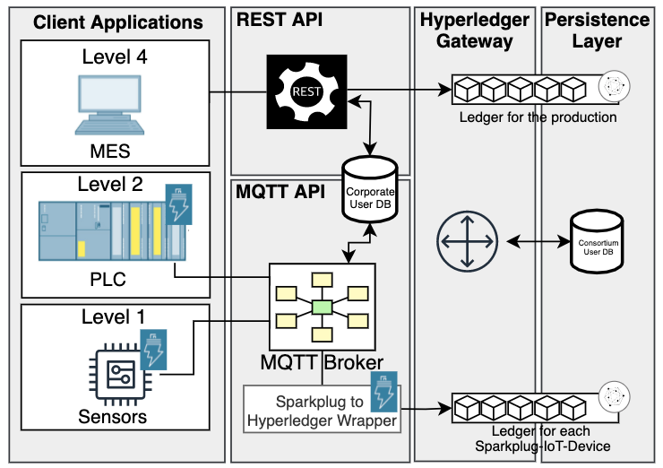 
      
     Fig. 6: Architecture example including a MQTT- and REST-API connecting automation levels four, two and one

<i><b>Source:</b> Seidenfad, K., Hoiss, T., & Lechner, U. (2021). A blockchain to bridge business information systems and industrial automation environments in supply chains. In G. Krieger, U.R., Eichler, G., Erfurth, C., Fahrnberger (Ed.), 21st International Conference on Innovations for Community Services. Springer.
</i>  

The concept shown in Fig. 6 utilizes two generic structures (cf. Fig. XXX and Fig. XXX) as follows: The MES is aware of the machines' running jobs and knows the Sparkplug compliant namespace of each involved device. Each time a new job is finished, the MES adds the namespace of the active machine to the product-lot as a new attribute. Since the new lot is timestamped and contains a unique namespace, we can now query the ledger of the production machine precisely by the tuple of topic-domain and timestamp. Each device has its own ledger, and each ledger can be concatenated from top to down. I.e., a machine has its own ledger, which is referring to the ledgers of its subcomponents.
Our solution benefits from the combination of the generic structures of Sparkplug and the NutriSafe Meta Model. The flexible data model of NutriSafe (cf. Fig. 7) enables to address the full bandwidth of products in the food industry. Annotating predecessor and successor to each product-lot empowers, e.g., authorities to make a forward and backward tracing on the supply chain data. Within specific tracing cases, it is necessary to query data about the OT-environment which was involved in the production process. Here Sparkplug comes into play. The semantic granularity ranges from production lines, over single machines and down to components such as actuators or sensors. Furthermore, industrial environments are shaped by patchworks of modern and also historically grown legacy infrastructures. Here our current data model faces limitations because it does not offer a means to integrate these infrastructural data.

     

## The Meta Definition

The meta definition represents a data set of diverse product specifications. It enables to extend a product model in a running blockchain, whereas the REST API offers an interface and identity handling for client applications that intend to connect to the Hyperledger Fabric network. 
The meta definition allows to manage a large and diverse number of different product representations in the blockchain. The meta definition is saved as one key-value pair on the ledger with the key predefined as METADEF. The meta definition contains a unitList, describing possible unit metrics for products, an attributeToDataTypeMap, which maps datatypes to attributes and a productNameToAttributesMap, which connects a list of attributes to a product type.  

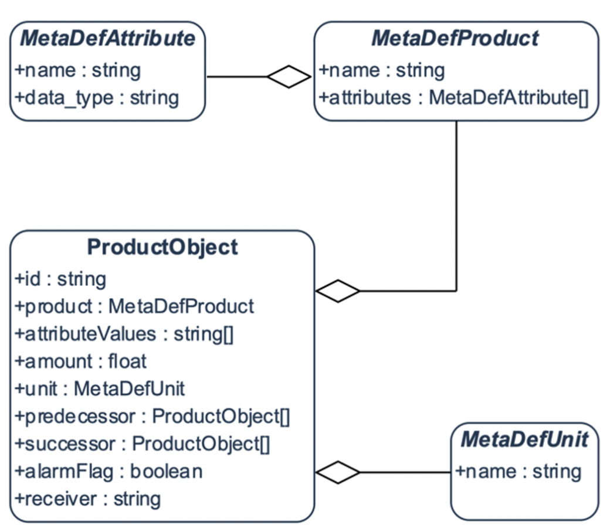 
  
   
    Fig. 7: The meta definition

<i>
<b>Source:</b> Lamken, D., Wagner, T., Hoiss, T., Seidenfad., K., Hermann, A., Kus, M., & Lechner, U. (n.d.). Design patterns and framework for blockchain integration in supply chains. 2021 IEEE International Conference on Blockchain and Cryptocurrency (ICBC) 
</i> 

## Channel Topology

In Hyperledger Fabric, there are ordering nodes, endorsing, and committing peers. Ordering nodes are the central component that orders incoming transactions in blocks using the RAFT consensus algorithm. Endorsing peers have chaincode installed and are responsible for creating so-called Read-Write-Sets by executing the chaincode for a transaction proposal send by a client. After calculation, the result is sent back to the client without the transaction's commitment to the ledger. The Read-Write-Set is then sent to the ordering nodes for the transaction record and block creation. 
Channels organize the peers. Each channel has its chaincode deployed and contains its blockchain. Transactions are only visible for all participants in the same channel.

 
      
     Fig. 8: The channel topology for the NutriSafe softcheese szenario

<i><b>Source:</b> Seidenfad, K., Hoiss, T., & Lechner, U. (2021). A blockchain to bridge business information systems and industrial automation environments in supply chains. In G. Krieger, U.R., Eichler, G., Erfurth, C., Fahrnberger (Ed.), 21st International Conference on Innovations for Community Services. Springer.</i> 

In our scenario shown in Fig. 8, we instantiate two application channels: the first one provides a track-and-trace functionality for products of all kinds; the second one implements functions and data models for organizing shipments by a logistics network. In our scenario, one supply chain participant is part of both channels and, thus, sees all transactions. The construct of private data collections ensures confidentiality inside a channel. This allows sharing of information on a peer-to-peer basis without a recording of the data in the blockchain. To ensure private data integrity, a hash-value of the data is committed and stored in the blockchain. In general, the channel topology and private data collection structure depend on the consortium.

## Blockchain Operations Framework

We draw on our previous findings on designing and operating a blockchain-based solution with Hyperledger Fabric as a technical platform to review the blockchain-specific operational task and group them into seven categories (Fig. 9). These seven categories give the structure for building and operating a blockchain. For each category, we provide operational processes and scripts to support these as well as the off-chain coordination necessary for secure blockchain operation. All seven categories and the processes are instantiated within the blockchain-based information system of the previously introduced soft cheese supply chain scenario.

     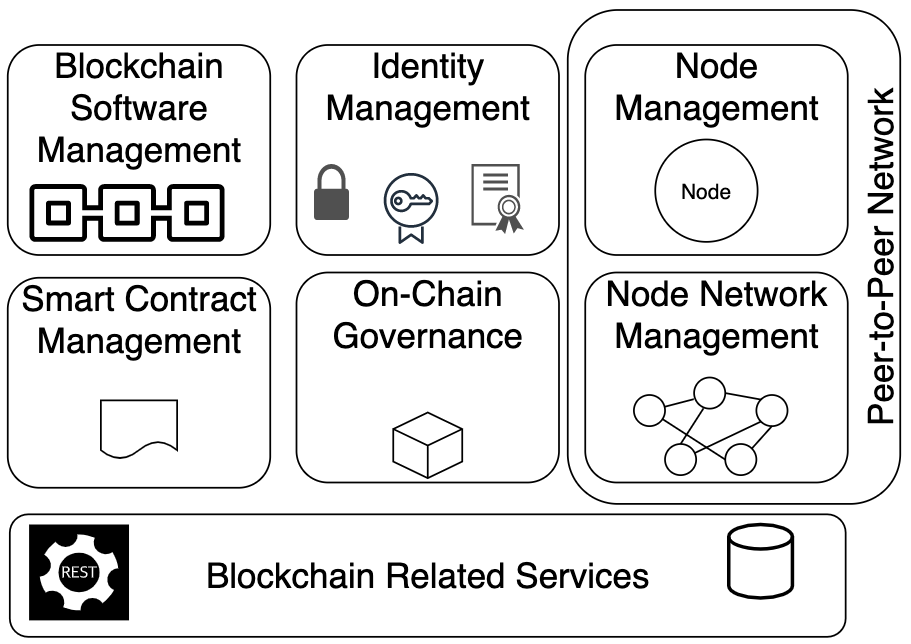 
      
     Fig. 9: The blockchain operations categories

<i><b>Source:</b> Hoiss, T., Seidenfad, K. & Lechner, U. (2021). Blockchain Service Operations – A Structured Approach to Operate a Blockchain Solution. To be appear in IEEE DAPPS 2021
</i> 

### Blockchain Operations Categories

<b>Blockchain Software Management.</b> This category includes operational processes of the blockchain software used to develop and change core algorithms running in the blockchain. For each blockchain network a basic set of rules and algorithms need to be developed. In most cases this protocol and its implementation are provided by open-source projects like Bitcoin, Ethereum or the Hyperledger project. Note that Hyperledger Fabric follows a “pluggable principle” where even core functionality of the protocol such as the consensus algorithm can be replaced. Such changes in core functionality need to be coordinated for a joint transition of the whole blockchain network to avoid forks or inconsistencies. The coordination of changes for joint transitions across all participants is part of this category. In NutriSafe, we decided to employ the RAFT algorithm since it provides crash fault tolerance. That is important as we strive to increase resilience in the network. The RAFT algorithm is suitable for our scenario since all participants can be trusted. Should the network expand to include untrusted participants, a transition of the consensus algorithm to a byzantine fault-tolerant algorithm as described in can become an option.

<b>Identity Management.</b> This category includes all tasks related to IT-management of cryptographic material. This includes the management of certificates, i.e., creating or revoking certificates as operational activities. In blockchains, certificates and private keys are used for signing the transactions to ensure integrity, for transport layer encryption, and for managing access in permissioned blockchains. Operating a public key infrastructure and corresponding (intermediate) certificate authorities is a common task in current service operations. A blockchain integrated with business information system architecture relies on certificate management. Exchanging certificates securely is a core aspect of general network security. Certificate exchange is crucial to (1) ensuring transport layer encryption, (2) ensuring the integrity of the identities, and (3) managing access control to the network. The provided script as part of our research is named “createCryptoMaterial.sh” It is designed to ease the setup of the certificate infrastructure. A yaml configuration file for each organization is used as input. It utilizes the command-line tool provided by Hyperledger Fabric cryptogen to generate CA root certificates, TLS-CA root certificates, TLS, and identity certificates for each node in the organization, as well as identity certificates for one admin and one user per organization. Each certificate is provided with the corresponding private key.

<b>Node Management.</b> This category includes all tasks related to operating nodes. Peer-to-peer networks are a critical characteristic of decentralized blockchain networks. We split the operating of the node by itself from the networking in a peer-to-peer network. Note that Hyperledger Fabric distinguishes between endorsing and committing peers and ordering nodes.
Ordering nodes are part of the consensus algorithm and responsible for forming and publishing new blocks. Committing peers simply accept and store new blocks while endorsing peers execute chaincode. Both peer types need a world state database. The Hyperledger Fabric project provides docker images for all nodes and the world state database. These need to be configured, started, and maintained. In our operations design, we merge all the information on the nodes’ configuration in a single file: “dockerComposePeers.yaml”. Bootstrapping all components requires one shell command $ docker compose up -f dockerComposePeers.yaml. This structure of a single file and command reduces complexity in the process of node bootstrapping while still having the configuration of dependent parts close together. Maintaining running nodes may include tasks like status monitoring, configuration backup and updating underlying images. In a production scenario, each organization would start its own nodes depending on its IT-environment.

<b>Node Network Management.</b> This category includes all tasks related to securely connecting the nodes to the blockchain with network and channels. In Hyperledger Fabric peers fetch the latest configuration block from the ordering service prior to joining a channel. To orchestrate the fetching and joining, we prepared a script called “peerJoinChannel.sh”. In our experimental setting all nodes are connected to a single virtual network. In a production setup, tasks of managing the connections and security settings between the different organizations are part of this category. The necessary off-chain coordination comprises of exchanging TLS certificates and ordering node addresses.

<b>Governance.</b> This category contains all tasks concerning the governance in the blockchain network. All processes to coordinate and set the rules of the permissioned blockchain network, e.g. rules for participation in the network are grouped together. In Hyperledger Fabric, parts of the network configuration are stored in so-called configuration blocks, which are by themselves part of the blockchain. These configuration blocks are propagated and handled like normal transaction blocks. Typical tasks are adding new organizations as channel participants or creating new consortiums in existing networks. In our scenario we postulate an evolving network. The setup we defined for bootstrapping a network consists of setting up as a first step three ordering nodes forming the ordering service and one predefined consortium. In a second step, we add organizations to the consortium and bootstrap a new application channel for the TrackAndTrace consortium. Several organizations join one by one the newly created channel. This procedure differs from most sample implementations since we do not start the network fully configured but instead expand the network over time. To ease this process, we developed scripts for common participant changes in the network which create the corresponding configuration transaction (1) add a consortium (“addConsortium.sh”), (2) add a member to a consortium (“addMemberToConsortium.sh”) and (3) add a member to a channel (“addMemberToChannel.sh”). These scripts can work for every instance of a Hyperledger Fabric network with only a few parameters as, e.g., the channel name, ordering node address, and the TLS certificates of the ordering node. The next phase is the signing of the created configuration transactions, which requires off-chain coordination and exchange of the transaction file. In our scenario, we configure a policy where the majority of channel participants need to sign the transaction before it is accepted by the ordering service.

<b>Smart Contract Management.</b> This category includes all tasks related to developing, deploying, and updating smart contracts. This category is optional depending on if the chosen blockchain framework supports smart contract functionality. Hyperledger Fabric supports so-called chaincode, while a channel has only one chaincode and a chaincode can consist of several smart contracts. In our scenario, we deploy two chaincodes, a TrackAndTrace and a LogisticNetwork chaincode. The TrackAndTrace chaincode enables efficient tracking and tracing of batches, while LogisticNetwork provides tracking and tracing of shipments in a part-loading logistics network. In the design, two different channels are used following the design principle of separating functionalities. One organization is part of both. 
A critical aspect in practice is smart contract management e.g., updates. Our approach is to minimize updates since every new chaincode needs to be distributed to every participating organization. Through the meta-model pattern, we reduce updates concerning the data model or product changes in the TrackAndTrace channel. 
The deployment of chaincode requires coordination between the participating organizations. In our operations design, chaincode is built and packaged by one organization and then disseminated to all other peers. Each organization deploys the chaincode by itself and approves it on-chain. 
As the last step, one organization commits the chaincode activating it for the channel. We developed a script called “installChaincode.sh,” which takes care of the previous task to deploy the chaincode in the complete network. This comes in handy in a research setting because it enables a fast way to test smart contracts in a near-production scenario.

<b>Blockchain Related Services.</b> This category collects blockchain-related services like interfaces or wallets. A challenge in our scenario was to interact with the blockchain from existing applications. Therefore, we developed a general- purpose REST-API which operates independent of the chaincode and provides an interface which can be used for all kind of applications. This single interface can be instantiated by each organization. The credentials are stored on the REST-API server, which acts as one client identity in the blockchain network. Other related services are submitting file hashes of off-chain documents for proof of existence or business intelligence services on blockchain data. These examples show that there are components which are not vital for the blockchain itself but still useful for a blockchain-based information system.

### Integrated Operational Process - "Onboarding an Organization"

This section presents an integrated operational process of a new organization joining an existing network channel. This process demonstrates the blockchain operations categories and their interplay and illustrates how a blockchain network’s consortium can annotate fine-grained responsibilities. We employ the process of onboarding a new employee in a corporate environment as a metaphor. This process includes human resources, corporate IT, financial accounting, and each of the departments has its subroutines. Our “departments” are the blockchain operations (Fig. 9). Note that this exemplary process involves five of seven blockchain operations categories.

     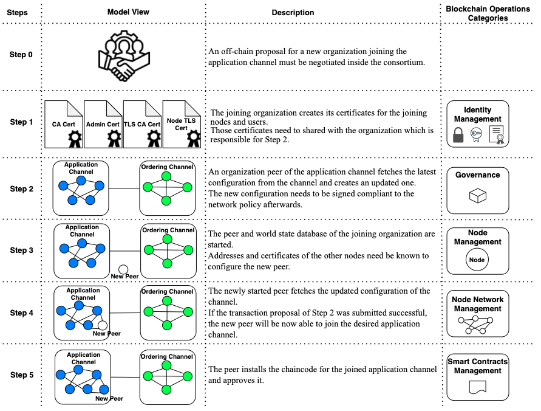 
      
     Fig. 10: The step-by-step process of onboarding a new organization with the corresponding blockchain operations categories

<i><b>Source:</b> Hoiss, T., Seidenfad, K. & Lechner, U. (2021). Blockchain Service Operations – A Structured Approach to Operate a Blockchain Solution. To be appear in IEEE DAPPS 2021
</i> 

Fig. 10 depicts the process of joining an existing channel in a blockchain network with the steps:  
<b>Step 0:</b> An off-chain proposal for a new organization joining the application channel must be negotiated in the consortium. This is a blockchain-agnostic business process.  
<b>Step 1:</b> The joining organization creates certificates for its joining nodes and users. Those certificates need to be shared with the organization which is responsible for Step 2. Scripts from the Identity Management category are used in this step. The joining organization is responsible for this step.  
<b>Step 2:</b> One organization already part of the application channel prepares the configuration transaction. The tasks of adding the joining organization to the member section of the application channel contains several Hyperledger specific subtasks: fetching the latest configuration from the channel, creating an updated one, signing the transaction and committing it. Technically any organization in the application channel can process these subtasks, but the business must clearly address this responsibility and answering questions like: Who is responsible for preparing the first proposal? Who needs to sign the transaction before the network will accept it? Who commits the updated signed transaction? These activities belong to the Governance category.  
<b>Step 3:</b> In this step peers and world state databases of the joining organization are started. Addresses and certificates of the other nodes need to be known to configure the new peer. The operational task of configuring and starting peers and their databases belong to the Node Management category. This is step is carried out by the joining organization by utilizing configuration details of the network which must be shared off- chain.  
<b>Step 4:</b> The newly started peer fetches the updated channel configuration. For this to happen the address and certificate of one ordering node need to be available. If the transaction proposal of Step 2 was submitted successfully, the new peer would now be able to join the desired application channel. The network and channel connection are managed in the Node Network Management category. The tasks are carried out by the joining organization since the joining organization was already accepted as a new member of the channel in Step 2.  
<b>Step 5:</b> The peer installs the chaincode for the joined application channel and approves it. Developing, maintaining, and distributing chaincode as an off-chain processes belongs to the category Smart Contract Management. All peers need to install the same business logic in the chaincode which needs consensual distributed software development.  
Note that the depicted process contains just five of seven blockchain operations categories. It does not contain Blockchain Protocol Management because changes at the protocol level are typically not done in the onboarding process. Essential rules of establishing consensus are usually changed when adding new organizations e.g. changes in the transaction endorsing policies. We also assume in the exemplified process that Blockchain Related Services are not necessary since they address blockchain external processes. 
The model shows the operation categories’ interplay in day-to-day tasks with their on-chain and off-chain processes. The seven operation categories require different skillsets, and most likely several people or departments will be responsible for them.

### The Script Environment and Documentation Model

The Hyperledger Fabric framework provides a set of scripts for basic network management operations by default. A toolchain for the generation, configuration, and administration of fabric-based networks is realized using the Hyperledger Fabric framework's client software. However, most of the administrative operations require long sequences of commands executed in a strict order. Scripting those operations is fundamental for efficient network deployment and operation. Therefor, we elaborated a compact sheet for documenting these scripts and all its environmental dependencies and implications.

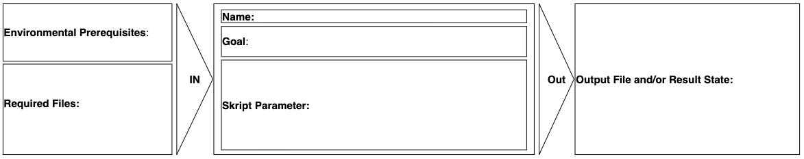

Fig. 11: The template for documenting a new script operation, which was developed inside the NutriSafe project

<i><b>Source:</b> Seidenfad, K., Hoiss, T., & Lechner, U. (2021). A blockchain to bridge business information systems and industrial automation environments in supply chains. In G. Krieger, U.R., Eichler, G., Erfurth, C., Fahrnberger (Ed.), 21st International Conference on Innovations for Community Services. Springer.</i>  

The documentation model consists of the following fields.  
<b>Name:</b> The name of the script file.
 
<b>Goal:</b> The desired goal by starting the script.
 
<b>Skript Parameter:</b> The parameters inside the script and the default value.
 
<b>Environmental Prerequisites:</b> Prerequisites, such as locally running processes or the presence of specific network entities.
 
<b>Required Files:</b> The presence of required files, such as certs, in the filesystem.
 
<b>Output File and/or Result State:</b> The result of the script operation, can be a output file oder the change of a state for a specific network entity.

#### create_crypto_peer_organisation.sh

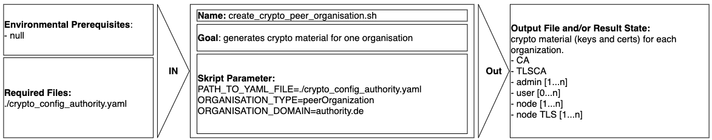

#### initialize_ordering_service.sh

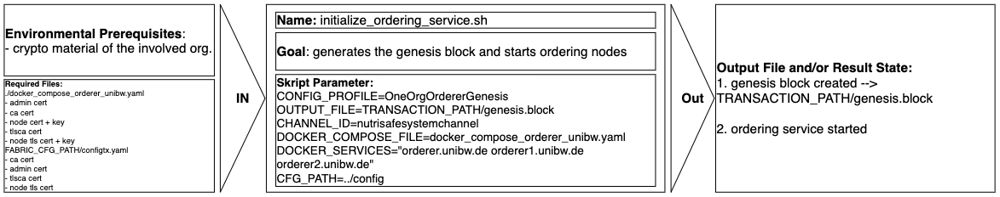

#### start_cli.sh

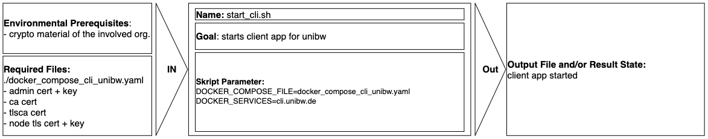

#### create_consortium.sh

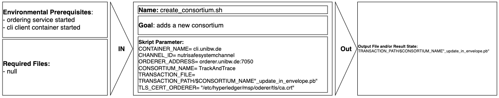

#### org_join_consortium.sh

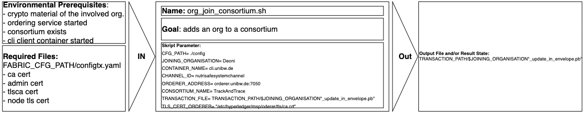

#### create_peer.sh

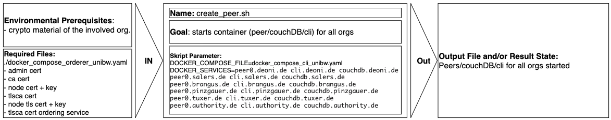

#### create_channel.sh

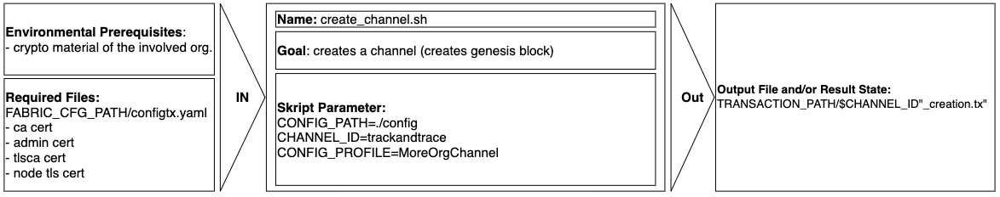

#### peer_channel_join.sh

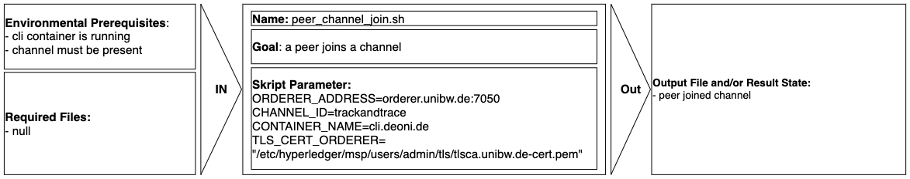

#### anchor_peer_update.sh

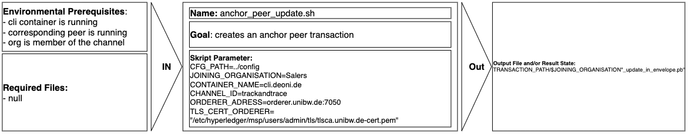

#### org_join_channel.sh

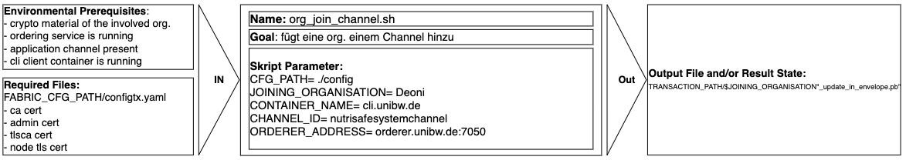

#### start_prometheus.sh

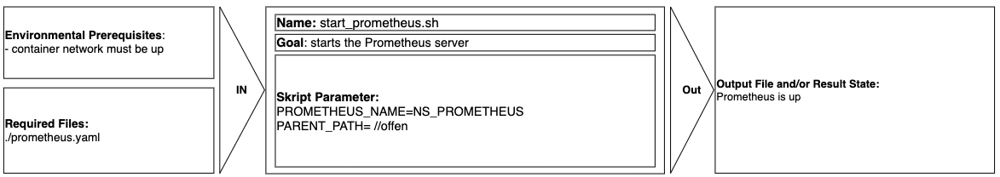