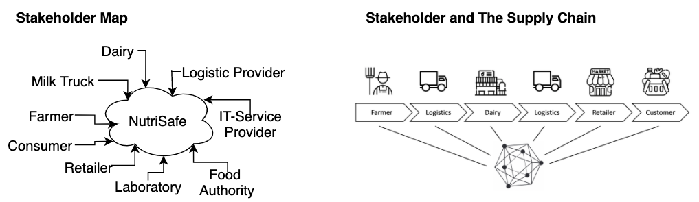
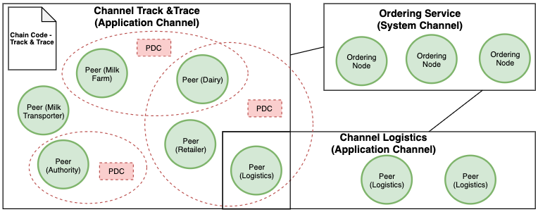
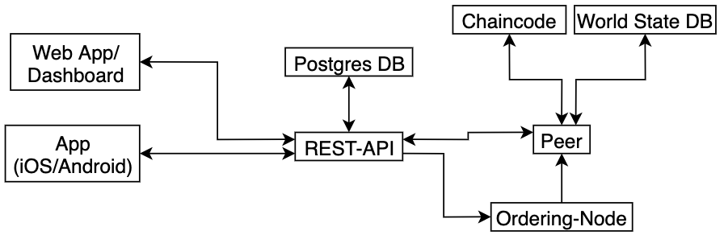

# The NutriSafe Architecture

### Business Architecture

<space><space>

 
TBD
 
TBD

### Channel Topology

 

### APIs

#### REST API

 

 

#### MQTT API

### The Meta Model

### Blockchain Operations Framework

#### Blockchain Operations Categories

#### Script Environment

