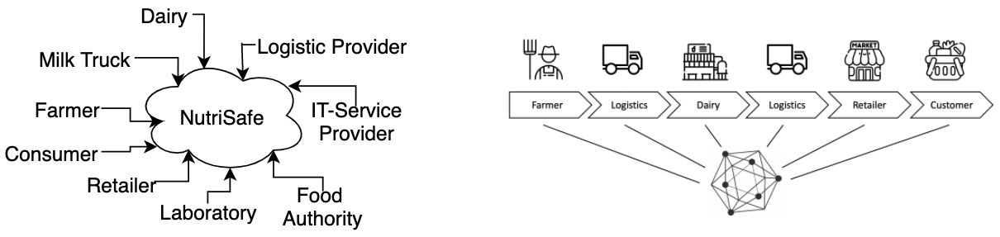

# The NutriSafe Architecture

### Business Architecture
<figure>
  
  <figcaption>
  Fig. X: Stakeholder map for the cheese supply chain (left)

  Fig. Y: Supply chain access to the blockchain (right)
  </figcaption>
</figure>

The community uses a stakeholder map shown in Fig. X and the NutriSafe infrastructure as the central element of the design. The community comprises many actors typical for any food supply chain and actors specific for the scenario of soft cheese production, namely dairy and milk truck.  
The supply chain depicted in Fig. Y starts with the milk farm. The milk farm hands over the fresh milk to a milk truck, which transports milk to the dairy and takes a sample for quality checks. The dairy processes fresh milk to produce, e.g., soft cheese transported by a logistics service provider to a retailer. The end customer buys the product, the soft cheese, at a grocery store. We assume that all actors use the blockchain to share information concerning production and logistics. A core user story is the creation of traceable product history. The product history is, e.g., providing information to the end-customer or for efficient tracking and tracing in a food safety issue.

### Architecture Layers

<figure>
   
  <figcaption>
  Fig. X: Conceptual architecture of a DLT-based supply chain  
  </figcaption>
</figure>

 
The conceptual architecture of a blockchain as infrastructure is depicted in Fig. X Actors have their information systems: ERP Systems, customer relationship management systems (CRM), herd management systems (HMS), and systems used by logistics service providers to manage transportation.
 
Note that the depicted supply chain is quite linear. In reality, there are many farmers, logistics service providers, production facilities, wholesalers, and retailers that participate in a supply chain. An analysis of the scenarios resulted in requirements and design decisions.

<figure float="right">
 
    <figcaption>
     Fig. Y: The layered architecture to bridge between applications and blockchain network
    </figcaption>
</figure>

<i>Reference to ICBC/I4CS paper</i>

The technical architecture is structured in four layers, as depicted in Fig. Y. The top "UI Layer" is populated by user-facing applications and enterprise applications. The applications enable end-users to store and access data in the blockchain.
 
The UI Layer contains the WebApp dashboard, an IOS application designed to enable mobile access and information provision to the blockchain state. The web application and the IOS app use JSON over HTTP to send REST-Calls to the NutriSafe REST API.
 
The API layer builds a layer of abstraction to the underlying system. The REST API and the EDI API provide the connectivity of user faced applications and the blockchain infrastructure. In small and medium-sized enterprises, EDI is a common standard for communication with business partners. REST is the de-facto standard for web-interfaces. We propose an EDI API which enables accessibility by enterprise applications.
The third layer is the "Persistence Layer" with the blockchain ledger and a shared user database. The shared user database enables the authenticity of users or systems for all APIs. The web application provides user management with an interface for adding, deleting, and changing user details and rights to invoke chaincode. 
 
Note that the current implementation uses whitelisting to define rights for function calls. Hyperledger Fabric in the 2.2 LTS version is used as the technical platform for the blockchain. 
The fourth layer contains the operational support and necessities for configuring and maintaining a Hyperledger Fabric network. The designed scripts for creating update transactions enable a fast way to expand the network. Configuration files are inherent by the blockchain framework and are customized for our scenario.

### APIs

#### REST API

<figure float="right">
 
         <figcaption>
     Fig. Y: The component model of the REST API
    </figcaption>
    </figure>

The REST API provides the interface for all web applications to the blockchain. Note that the first design iteration of NutriSafe utilizes a REST API for each organization.
 
The RESTful interface (cf. Fig. X) provides a set of functions to enable the interaction with the NutriSafe Hyperledger Fabric network. To authenticate the transaction proposals to the blockchain network, the user's organization's certificate and the corresponding key have to be accessible for the REST API. Custom clients transfer username and password to receive a JSON Web Token (JWT) per session on the REST API. Since the REST API hosts its own user database, user management is also part of its feature set. Customizable whitelists define the function calls per user and are adjustable to chaincode updates.

#### MQTT API

 

<i>Reference to I4CS paper</i>
     

### The Meta Model

### Channel Topology

 

### Blockchain Operations Framework

#### Blockchain Operations Categories

 

<i>Reference to DAPPS paper</i>

 

<i>Reference to DAPPS paper</i>

#### Script Environment

